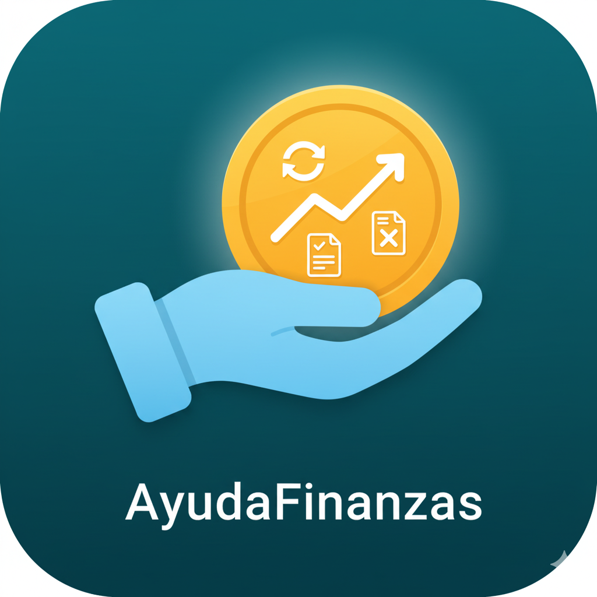

# AyudaFinanzas App

Esta Aplicación es un proyecto de prueba para la materia Programación 3, en el marco de la Tecnicatura en Desarrollo de Software cursada en el Instituto Superior Villa del Rosario.

---

## Funcionalidades Principales

- **Autenticación de Usuarios:**
  - Registro e inicio de sesión utilizando una API propia desarrollada en Node.js y desplegada en Render.
  - Gestión de sesión mediante JSON Web Tokens (JWT).

- **Gestión de Cheques Propios (CRUD completo):**
  - **Registrar (POST):** Permite cargar los datos de un cheque y subir una imagen del mismo a Cloudinary a través de la API propia.
  - **Consultar (GET):** Muestra una lista de todos los cheques registrados por el usuario, cargando las imágenes desde la URL de Cloudinary.
  - **Actualizar (PUT):** Permite modificar el estado de un cheque (En cartera, Depositado, Rechazado, etc.).
  - **Eliminar (DELETE):** Permite borrar un cheque de la cartera del usuario.

- **APIs del Banco Central (BCRA):**
  - **Estadísticas Cambiarias:** Consulta de cotizaciones de divisas por rango de fechas.
  - **Central de Deudores:** Consulta de la situación crediticia de un CUIT/CUIL en el sistema financiero.
  - **Cheques Denunciados:** Verificación de si un cheque específico ha sido denunciado.

## Tecnologías Utilizadas

- **Lenguaje:** 100% Kotlin.
- **Arquitectura:** Cliente-Servidor.
- **Networking:** Retrofit para el consumo de APIs REST.
- **Carga de Imágenes:** Glide.
- **Diseño:** Material Design 3, iconos vectoriales y layouts responsivos.

---

## Demostración

Haz clic en la imagen para ver un video de la aplicación en funcionamiento:

Muchas gracias por su atención...!!!
